# WorkZen HRMS - Data Flow Diagram (DFD)

## Level 0 - Context Diagram

```mermaid
flowchart TD
    %% External Entities
    Employee[👤 Employee]
    HR[👥 HR Manager]
    Payroll[💰 Payroll Officer]
    Admin[🔧 Admin]
    EmailSystem[📧 Email System]

    %% Main System
    HRMS[🏢 WorkZen HRMS System]

    %% Data Flows
    Employee -->|Login Credentials, Attendance, Time-off Requests| HRMS
    HRMS -->|Payslips, Attendance Records, Leave Status| Employee

    HR -->|Employee Data, Leave Approvals, Reports| HRMS
    HRMS -->|Employee Reports, Leave Requests, Analytics| HR

    Payroll -->|Salary Data, Payroll Processing| HRMS
    HRMS -->|Payroll Reports, Payslips, Calculations| Payroll

    Admin -->|User Management, System Config| HRMS
    HRMS -->|System Reports, Audit Logs| Admin

    HRMS -->|Notifications, Invitations, Payslip Alerts| EmailSystem
    EmailSystem -->|Email Delivery Status| HRMS
```

## Level 1 - Main Process Breakdown

```mermaid
flowchart TD
    %% External Entities
    Users[👥 Users]
    Employees[👤 Employees]
    Management[👔 HR/Payroll/Admin]
    EmailService[📧 Email Service]

    %% Main Processes
    P1[1.0<br/>Authentication &<br/>User Management]
    P2[2.0<br/>Employee<br/>Management]
    P3[3.0<br/>Attendance<br/>Tracking]
    P4[4.0<br/>Time-off<br/>Management]
    P5[5.0<br/>Payroll<br/>Processing]
    P6[6.0<br/>Payslip<br/>Generation]
    P7[7.0<br/>Reports &<br/>Analytics]

    %% Data Stores
    DS1[(D1: Users)]
    DS2[(D2: Employees)]
    DS3[(D3: Attendance)]
    DS4[(D4: Time-off)]
    DS5[(D5: Payroll)]
    DS6[(D6: Payslips)]
    DS7[(D7: Audit Logs)]
    DS8[(D8: Email Logs)]

    %% User Interactions
    Users -->|Registration/Login| P1
    P1 -->|JWT Token| Users
    P1 -->|User Data| DS1
    DS1 -->|User Verification| P1

    Management -->|Employee Creation| P2
    P2 -->|Employee Records| DS2
    DS2 -->|Employee Data| P2
    P2 -->|Employee Info| Management

    Employees -->|Clock In/Out| P3
    P3 -->|Attendance Records| DS3
    DS3 -->|Attendance Data| P3
    P3 -->|Attendance Status| Employees

    Employees -->|Leave Requests| P4
    P4 -->|Time-off Records| DS4
    DS4 -->|Leave Data| P4
    Management -->|Approval/Rejection| P4
    P4 -->|Leave Status| Employees

    Management -->|Payroll Period| P5
    DS2 -->|Employee Salary Data| P5
    DS3 -->|Attendance Records| P5
    DS4 -->|Leave Records| P5
    P5 -->|Payroll Data| DS5

    P5 -->|Finalized Payroll| P6
    DS5 -->|Payroll Lines| P6
    P6 -->|PDF Payslips| DS6
    DS6 -->|Payslip Files| Employees

    DS1 & DS2 & DS3 & DS4 & DS5 -->|All Data| P7
    P7 -->|Analytics| Management

    %% Email Notifications
    P1 -->|Invitations/Verification| EmailService
    P4 -->|Leave Notifications| EmailService
    P6 -->|Payslip Alerts| EmailService
    EmailService -->|Email Status| DS8

    %% Audit Trail
    P1 & P2 & P3 & P4 & P5 & P6 -->|Action Logs| DS7
```

## Level 2 - Detailed Process Flows

### Authentication & User Management Process

```mermaid
flowchart TD
    %% Inputs
    UserInput[User Credentials]
    InviteData[Invitation Data]

    %% Sub-processes
    P11[1.1<br/>User Registration]
    P12[1.2<br/>User Login]
    P13[1.3<br/>Password Reset]
    P14[1.4<br/>User Invitation]
    P15[1.5<br/>Token Management]

    %% Data Stores
    DS1[(D1: Users)]
    DS2[(D8: Email Tokens)]
    DS3[(D9: Email Logs)]

    %% Flows
    UserInput -->|Registration Data| P11
    P11 -->|Hash Password| P11
    P11 -->|New User| DS1
    P11 -->|Verification Token| P15
    P15 -->|Email Token| DS2
    P15 -->|Send Verification| EmailService[📧 Email Service]

    UserInput -->|Login Credentials| P12
    DS1 -->|User Record| P12
    P12 -->|Validate Password| P12
    P12 -->|JWT Token| UserOutput[Authenticated User]

    UserInput -->|Reset Request| P13
    DS1 -->|User Lookup| P13
    P13 -->|Reset Token| P15
    P15 -->|Reset Email| EmailService

    InviteData -->|Invite User| P14
    P14 -->|Create User| DS1
    P14 -->|Invite Token| P15
    P15 -->|Invite Email| EmailService

    EmailService -->|Email Status| DS3
```

### Payroll Processing Detailed Flow

### Attendance Tracking Flow

```mermaid
flowchart TD
    %% Employee Actions
    ClockIn[🕘 Clock In Request]
    ClockOut[🕔 Clock Out Request]
    ViewAttendance[👀 View Attendance]

    %% Processes
    P31[3.1<br/>Validate Clock In]
    P32[3.2<br/>Record Clock In]
    P33[3.3<br/>Validate Clock Out]
    P34[3.4<br/>Calculate Hours]
    P35[3.5<br/>Update Record]
    P36[3.6<br/>Generate Reports]

    %% Data Store
    DS3[(D3: Attendance)]

    %% Validations
    TodayCheck{Today's Record<br/>Exists?}
    AlreadyClockedIn{Already<br/>Clocked In?}
    AlreadyClockedOut{Already<br/>Clocked Out?}

    %% Flow
    ClockIn --> P31
    P31 --> TodayCheck
    TodayCheck -->|No| P32
    TodayCheck -->|Yes| AlreadyClockedIn
    AlreadyClockedIn -->|No| P32
    AlreadyClockedIn -->|Yes| ErrorMsg[Error: Already Clocked In]

    P32 -->|New Attendance Record| DS3
    DS3 -->|Success| ClockInSuccess[✅ Clock In Success]

    ClockOut --> P33
    P33 --> DS3
    DS3 -->|Today's Record| AlreadyClockedOut
    AlreadyClockedOut -->|No| P34
    AlreadyClockedOut -->|Yes| ErrorMsg2[Error: Already Clocked Out]

    P34 -->|Calculate Total Hours| P35
    P35 -->|Updated Record| DS3
    DS3 -->|Success| ClockOutSuccess[✅ Clock Out Success]

    ViewAttendance --> P36
    DS3 -->|Attendance History| P36
    P36 -->|Formatted Data| AttendanceReport[📊 Attendance Report]
```

### Time-off Management Flow

```mermaid
flowchart TD
    %% Inputs
    LeaveRequest[📝 Leave Request]
    ApprovalAction[✅ Approval/Rejection]

    %% Processes
    P41[4.1<br/>Validate Request]
    P42[4.2<br/>Submit Request]
    P43[4.3<br/>Notify Approvers]
    P44[4.4<br/>Process Approval]
    P45[4.5<br/>Update Status]
    P46[4.6<br/>Notify Employee]

    %% Data Store
    DS4[(D4: Time-off)]
    DS1[(D1: Users)]
    DS8[(D8: Email Logs)]

    %% Validations
    DateValidation{Valid Date<br/>Range?}
    PastDateCheck{Future<br/>Dates?}
    StatusCheck{Status =<br/>PENDING?}

    %% Flow
    LeaveRequest --> P41
    P41 --> DateValidation
    DateValidation -->|Yes| PastDateCheck
    DateValidation -->|No| ValidationError[❌ Invalid Date Range]

    PastDateCheck -->|Yes| P42
    PastDateCheck -->|No| PastDateError[❌ Cannot Request Past Dates]

    P42 -->|New Request| DS4
    P42 --> P43

    P43 --> DS1
    DS1 -->|HR/Admin Users| EmailNotification[📧 Notification to Approvers]
    EmailNotification --> DS8

    ApprovalAction --> P44
    P44 --> DS4
    DS4 -->|Request Data| StatusCheck
    StatusCheck -->|Yes| P45
    StatusCheck -->|No| StatusError[❌ Already Processed]

    P45 -->|Updated Status| DS4
    P45 --> P46
    P46 -->|Employee Notification| EmailService[📧 Email Service]
    EmailService --> DS8

    DS4 -->|Final Status| RequestComplete[✅ Request Processed]
```

## Data Dictionary

### Data Stores

| Store | Name       | Description                      | Key Fields                                              |
| ----- | ---------- | -------------------------------- | ------------------------------------------------------- |
| D1    | Users      | User accounts and authentication | id, email, password_hash, role, is_verified             |
| D2    | Employees  | Employee records and salary info | id, user_id, employee_code, department, base_salary     |
| D3    | Attendance | Daily attendance tracking        | id, employee_id, date, check_in, check_out, total_hours |
| D4    | Time-off   | Leave requests and approvals     | id, employee_id, from_date, to_date, type, status       |
| D5    | Payroll    | Payroll runs and calculations    | id, period_start, period_end, total_gross, total_net    |
| D6    | Payslips   | Generated payslip files          | id, payrun_line_id, file_path, generated_at             |
| D7    | Audit Logs | System activity tracking         | id, user_id, action, details, timestamp                 |
| D8    | Email Logs | Email sending history            | id, to_email, subject, status, created_at               |

### Data Elements

| Element           | Type   | Description                | Validation                              |
| ----------------- | ------ | -------------------------- | --------------------------------------- |
| JWT Token         | String | Authentication token       | 1-hour expiry, signed with secret       |
| Employee Code     | String | Unique employee identifier | Format: EMP001, EMP002, etc.            |
| Attendance Status | Enum   | Daily status               | PRESENT, ABSENT, LATE                   |
| Leave Type        | Enum   | Type of time-off           | SICK, CASUAL, ANNUAL, UNPAID, MATERNITY |
| Leave Status      | Enum   | Request status             | PENDING, APPROVED, REJECTED             |
| Payroll Status    | Enum   | Payrun status              | DRAFT, FINALIZED                        |
| User Role         | Enum   | System roles               | ADMIN, HR, PAYROLL, EMPLOYEE            |

### External Entities

| Entity          | Description              | Interactions                                      |
| --------------- | ------------------------ | ------------------------------------------------- |
| Employee        | System end-users         | Login, attendance, leave requests, payslip access |
| HR Manager      | Human resources staff    | Employee management, leave approvals, reports     |
| Payroll Officer | Payroll processing staff | Salary management, payroll processing             |
| Admin           | System administrators    | User management, system configuration             |
| Email System    | External email service   | Send notifications, invitations, alerts           |

## Security & Validation Flows

```mermaid
flowchart TD
    %% Request Flow
    HTTPRequest[🌐 HTTP Request]

    %% Security Layers
    CORS[🛡️ CORS Validation]
    Auth[🔐 JWT Authentication]
    RoleCheck[🚦 Role Authorization]
    InputValidation[📋 Input Validation]

    %% Processing
    Controller[🎮 Controller Logic]
    Service[🔧 Service Layer]
    Database[🗄️ Database Operation]
    AuditLog[📝 Audit Logging]

    %% Response
    JSONResponse[📤 JSON Response]

    %% Error Handling
    ValidationError[❌ Validation Error]
    AuthError[❌ Auth Error]
    ServerError[❌ Server Error]

    %% Flow
    HTTPRequest --> CORS
    CORS --> Auth
    Auth -->|Valid| RoleCheck
    Auth -->|Invalid| AuthError

    RoleCheck -->|Authorized| InputValidation
    RoleCheck -->|Unauthorized| AuthError

    InputValidation -->|Valid| Controller
    InputValidation -->|Invalid| ValidationError

    Controller --> Service
    Service --> Database
    Database --> AuditLog
    AuditLog --> JSONResponse

    %% Error Paths
    Controller -->|Error| ServerError
    Service -->|Error| ServerError
    Database -->|Error| ServerError

    ValidationError --> JSONResponse
    AuthError --> JSONResponse
    ServerError --> JSONResponse
```

This comprehensive DFD shows the complete data flow architecture of the WorkZen HRMS system, from high-level context down to detailed process flows with security considerations.
